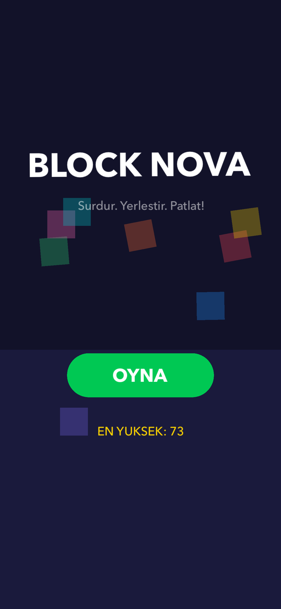
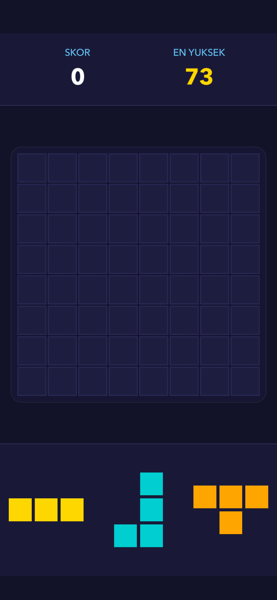
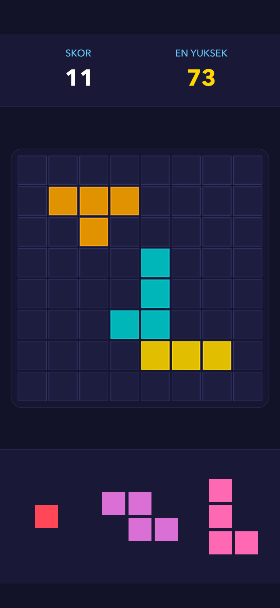
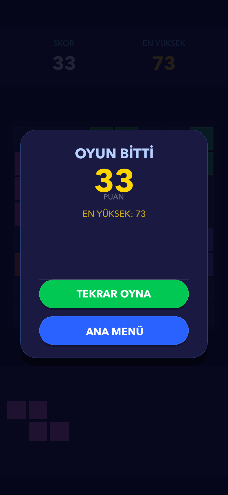

# BlockNova

> **Sürükle. Yerleştir. Patlat!** — A minimalist block puzzle game for iPhone.

<p align="center">
  
  &nbsp;&nbsp;
  
  &nbsp;&nbsp;
  
  &nbsp;&nbsp;
  
</p>

---

## Overview

**BlockNova** is a drag-and-drop block puzzle game built with Apple's **SpriteKit** framework. Players drag colorful pieces onto an 8×8 grid, filling rows or columns to clear them and earn points. The game ends when no remaining piece fits on the board.

The design philosophy is **minimalism meets strategy**: no timers, no rotation — pure spatial reasoning and planning ahead.

---

## Screenshots

| Home Screen | Game Start | Gameplay | Game Over |
|:-----------:|:----------:|:--------:|:---------:|
|  |  |  |  |
| Animated logo & floating blocks | Empty 8×8 grid, 3 pieces ready | Pieces placed, score updating | Score summary with Play Again |

---

## Features

### Core Gameplay
- **8×8 Grid** — Classic block puzzle board
- **11 Unique Shapes** — Single cell, 2/3-cell lines, 2×2 square, L, J, T, S, Z tetrominos and variants
- **Drag & Drop** — Smooth, finger-offset dragging; piece lifts above the thumb for clear visibility
- **Line Clearing** — Complete any full row or column to clear it and score points
- **Combo Bonus** — Clear multiple lines at once for bonus points (2 lines: +25, 3+ lines: +50)
- **Game Over Detection** — Game ends automatically when none of the 3 current pieces can be placed

### Scoring System
| Action | Points |
|--------|--------|
| Place each cell | +1 per cell |
| Clear 1 line | +10 |
| Clear 2 lines | +35 (10×2 + 25 bonus) |
| Clear 3+ lines | +n×10 + 50 bonus |

- **High Score** is saved permanently via `UserDefaults` and displayed on both the Home screen and in-game panel

### Visual Feedback
- **Green/Red highlight** — Hover feedback shows where a piece will land (green = valid, red = invalid)
- **Floating text effects** — "LINE!", "DOUBLE!", "COMBO x3!" animations on line clears
- **Score bounce** — Score label micro-animates on every update
- **"YENİ REKOR!" badge** — Pops when the player beats their high score mid-game
- **Game Over overlay** — Smooth modal with final score, all-time best, and action buttons

### Polish & UX
- **Haptic Feedback** — Distinct haptics for piece placement, line clears, and game over
- **Animated Home Screen** — 8 colorful floating blocks with drift + rotation loops
- **Pulse button animation** — The Play button gently pulses to invite a tap
- **Fade scene transitions** — Smooth 0.4s cross-fade between Home and Game scenes

### Smart Shape Distribution (3-Layer Algorithm)
BlockNova uses a sophisticated `ShapeDispenser` to keep the game fair and varied:

1. **Shuffle Bag** — All 11 shapes are placed in a bag and shuffled; each shape appears at least once per 11 draws
2. **History Memory (82% reject)** — The last 6 drawn shapes are tracked; shapes seen recently are rejected 82% of the time
3. **Round Uniqueness** — All 3 pieces offered in each round are always different shapes

---

## Architecture

```
BlockNova/
├── AppDelegate.swift
├── GameViewController.swift        # UIViewController host for SpriteKit
│
├── Scenes/
│   ├── HomeScene.swift             # Animated main menu scene
│   ├── GameScene.swift             # Core game loop & touch handling
│   ├── GameScene+Layout.swift      # Safe area-aware responsive layout
│   └── GameScene+Overlay.swift     # Game over modal construction
│
├── Nodes/
│   ├── GridNode.swift              # 8×8 grid rendering & game logic
│   ├── BlockNode.swift             # Individual cell node
│   └── PieceNode.swift             # Draggable piece composed of BlockNodes
│
├── Models/
│   ├── BlockShape.swift            # Shape definitions (11 types, colors, offsets)
│   ├── GameManager.swift           # Score tracking, state machine, high score persistence
│   └── ShapeDispenser.swift        # 3-layer balanced shape distribution algorithm
│
├── ViewModels/
│   └── GameViewModel.swift         # Presentation formatting (score text, labels)
│
└── Utils/
    ├── Constants.swift             # Responsive layout constants (all sizes % of screen)
    └── HapticManager.swift         # UIImpactFeedbackGenerator / UINotificationFeedbackGenerator
```

### Design Patterns
- **MVC + ViewModel** — `GameManager` (Model) → `GameViewModel` (ViewModel) → `GameScene` (View)
- **Delegate Pattern** — `GridDelegate` and `GameManagerDelegate` for decoupled event propagation
- **Responsive Layout** — Zero hardcoded pixel values; all sizes derived from `UIScreen.main.bounds`
- **Safe Area Aware** — Panels and grid respect `safeAreaInsets` on all iPhone models

---

## Tech Stack

| Technology | Usage |
|------------|-------|
| **Swift 5** | Primary language |
| **SpriteKit** | Game rendering, animations, scene management |
| **UIKit** | View controller, haptics, safe area |
| **UserDefaults** | Persistent high score storage |
| **Xcode** | IDE & build toolchain |

---

## Requirements

- **iOS 15.0+**
- **iPhone** (portrait orientation)
- Xcode 14+ to build from source

---

## How to Play

1. **Tap OYNA** on the home screen to start
2. Three pieces appear at the bottom tray
3. **Drag a piece** from the tray onto the grid — it snaps to the nearest valid cell
4. Fill a complete **row or column** to clear it and earn bonus points
5. When **no remaining piece fits** on the board, the game ends
6. Tap **TEKRAR OYNA** to restart or **ANA MENÜ** to return home

**Tips:**
- Plan 2–3 moves ahead — pieces can't be rotated
- Clearing multiple lines simultaneously triggers a combo bonus
- Keep the grid open in the center to maximize placement options

---

## Project Structure Notes

- All color constants live in `Constants.swift` with a neon palette (11 colors, one per shape type)
- `C.cellSize` and all layout metrics are computed from `C.screenW` / `C.screenH` at runtime — no storyboards, no Auto Layout
- `GameScene` is split into three files for clarity: core logic, layout, and overlay construction
- `HapticManager` wraps UIKit feedback generators with a clean API used across the codebase

---

## License

This project is proprietary. All rights reserved.

---

<p align="center">Built with Swift & SpriteKit</p>
