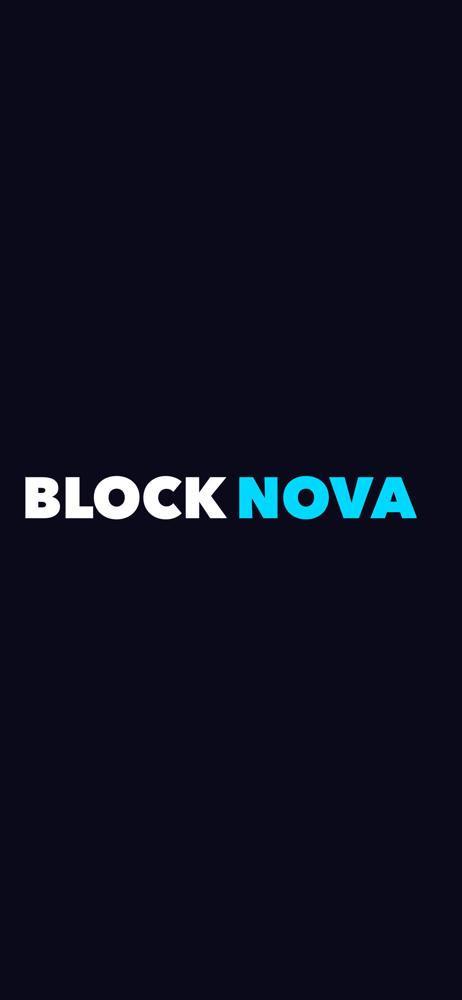
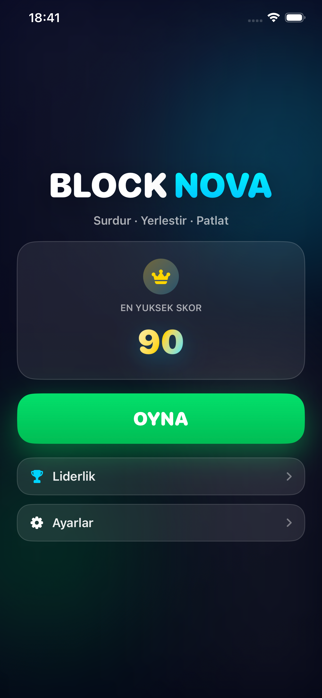
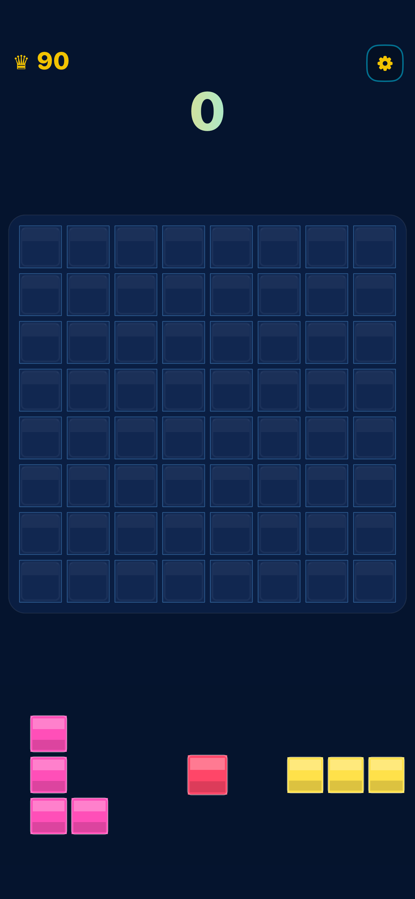
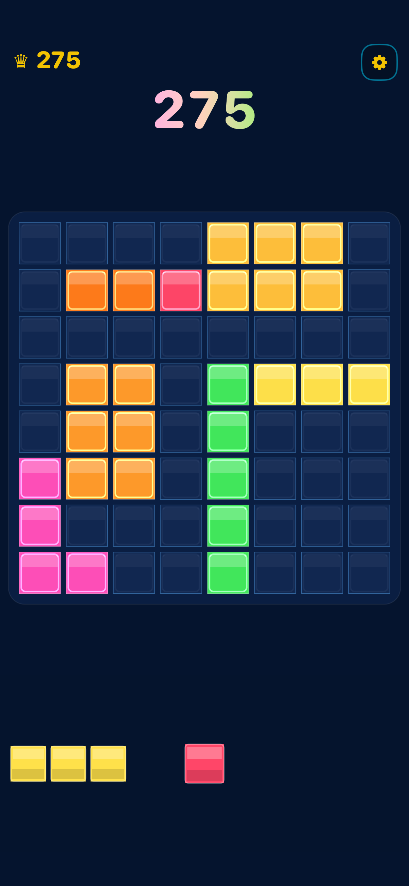
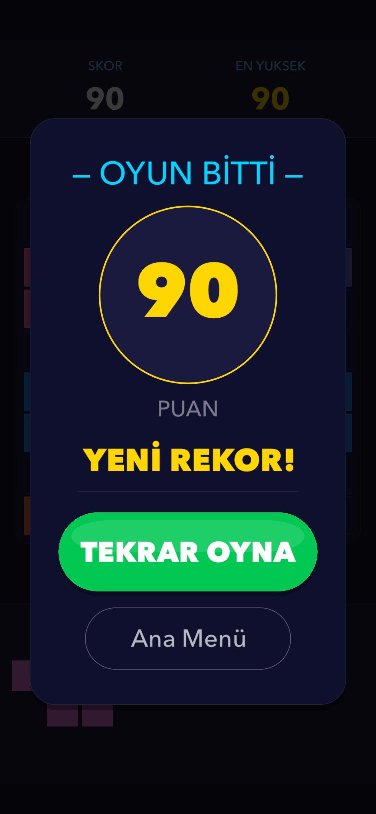

<div align="center">

# 🟦 Nova Block

**SpriteKit ile geliştirilmiş modern blok yerleştirme oyunu**

*Sürükle. Yerleştir. Patlat.*

<br/>

[](https://developer.apple.com/ios/)
[](https://swift.org)
[]()
[](https://apps.apple.com)

</div>

---

## 📸 Ekran Görüntüleri

<div align="center">
  
  &nbsp;&nbsp;
  
  &nbsp;&nbsp;
  
  &nbsp;&nbsp;
  
  &nbsp;&nbsp;
  
</div>

---

## ✨ Özellikler

### Temel Oynanış
- **8×8 ızgara** — Klasik blok bulmaca alanı
- **12 benzersiz şekil** — Tekli hücre, 2/3'lü çizgiler, 2×2/3×3 kareler, L / J / T / S / Z tetromino'lar
- **Akıllı sürükleme** — Parça parmağın üzerinden kalkar, ızgara hücresine snap'ler
- **Combo sistemi** — Aynı hamlede birden fazla çizgi patlatarak bonus puan kazan
- **Oyun sonu tespiti** — Hiçbir parça sığmadığında otomatik bitiş

### Puan Tablosu

| Aksiyon | Puan |
|---|---|
| Her yerleştirilen hücre | +1 |
| 1 çizgi temizleme | +10 |
| 2 çizgi temizleme | +35 *(10×2 + 25 bonus)* |
| 3+ çizgi temizleme | +n×10 + 50 *(combo bonusu)* |

### Görsel Geri Bildirim
- **Yeşil / Kırmızı önizleme** — Hover sırasında geçerli/geçersiz alanı anlık gösterir
- **Uçan metin efektleri** — `LINE!` · `DOUBLE!` · `COMBO x3!` animasyonları
- **"YENİ REKOR!"** — Oyun içinde rekor kırılınca badge patlar
- **Skor micro-animasyon** — Her güncelleme skor etiketini canlandırır

### Platform & UX
- **Game Center** liderlik tablosu entegrasyonu
- **Kaldığın yerden devam** — Uygulama kapansa bile oyun devam eder
- **Haptic feedback** — Yerleştirme, temizleme, oyun sonu için ayrı titreşimler
- **Ses efektleri** — Her aksiyon için özel ses
- **Loading ekranında arka plan auth** — Game Center girişi oyunu bloklamaz
- **Responsive tasarım** — Tüm iPhone boyutlarında pixel-perfect

---

## 🛠 Teknik Detaylar

| | |
|---|---|
| **Platform** | iOS 15.5+ · iPhone · Portrait |
| **Dil** | Swift 5 |
| **Framework** | SpriteKit · GameKit · UIKit |
| **Mimari** | MVC + Extension tabanlı |
| **Kalıcılık** | UserDefaults — sunucu yok, ağ bağlantısı yok |
| **Bağımlılık** | **Sıfır** — hiçbir third-party kütüphane |

---

## 📁 Proje Yapısı

```
BlockNova/
├── App/
│   ├── AppDelegate.swift           # Game Center auth başlatma
│   └── GameViewController.swift    # SpriteKit host, GKGameCenterControllerDelegate
│
├── Scenes/
│   ├── LoadingScene.swift          # Splash + arka plan auth bekleme
│   ├── HomeScene.swift             # Animasyonlu ana menü
│   ├── GameScene.swift             # Ana oyun döngüsü ve dokunma yönetimi
│   ├── GameScene+Layout.swift      # Safe area'ya duyarlı responsive yerleşim
│   └── GameScene+Overlay.swift     # Oyun sonu modal yapımı
│
├── Nodes/
│   ├── GridNode.swift              # 8×8 ızgara çizimi + oyun mantığı
│   ├── BlockNode.swift             # Tekil hücre node'u
│   └── PieceNode.swift             # BlockNode'lardan oluşan sürüklenebilir parça
│
├── Models/
│   ├── BlockShape.swift            # 12 şekil tanımı (tip, offset, renk)
│   ├── ShapeDispenser.swift        # 3 katmanlı dengeli dağıtım algoritması
│   └── GameManager.swift           # Skor, durum makinesi, Game Center entegrasyonu
│
├── ViewModels/
│   └── GameViewModel.swift         # Skor metinleri ve label formatlaması
│
└── Utils/
    ├── Constants.swift             # Tüm boyutlar screenW/screenH oransal
    ├── HapticManager.swift         # UIImpactFeedbackGenerator sarmalayıcısı
    ├── SoundManager.swift          # Ses efekti yönetimi
    └── GameSaveManager.swift       # UserDefaults ile save/restore
```

---

## 🏗 Mimari Kararlar

| Karar | Gerekçe |
|---|---|
| Fizik motoru kullanılmadı | Grid tabanlı mantık deterministik ve öngörülebilir |
| Node'lar silinmiyor, renk değiştiriliyor | Kasa (frame freeze) sorunlarını tamamen ortadan kaldırır |
| `touchesMoved`'da SKAction yok | Direkt `position` ataması ile gecikme sıfır, sürükleme akıcı |
| Tüm boyutlar `screenW/screenH` oransal | Hardcode piksel yok — her iPhone'da kusursuz |
| `GameManagerDelegate` pattern | Skor/durum değişiklikleri Scene'e gevşek bağlı — test edilebilir |

---

## 🚀 Kurulum

Xcode 15+ gereklidir. Bağımlılık yöneticisi gerekmez:

```bash
git clone https://github.com/muhammedeminalan/BlockNova.git
cd BlockNova
open BlockNova.xcodeproj
```

Simulator veya fiziksel cihazda direkt çalıştırılabilir. Game Center özellikleri fiziksel cihaz gerektirir.

---

## 👤 Geliştirici

<div align="center">

**Muhammed Emin Alan**

[](https://github.com/muhammedeminalan)
[](https://pub.dev/packages/wonzy_core_utils)

</div>

---

## 📄 Lisans

Bu proje **MIT Lisansı** altında dağıtılmaktadır.

---

<div align="center">
  <sub>Built with ❤️ using Swift & SpriteKit</sub>
</div>
