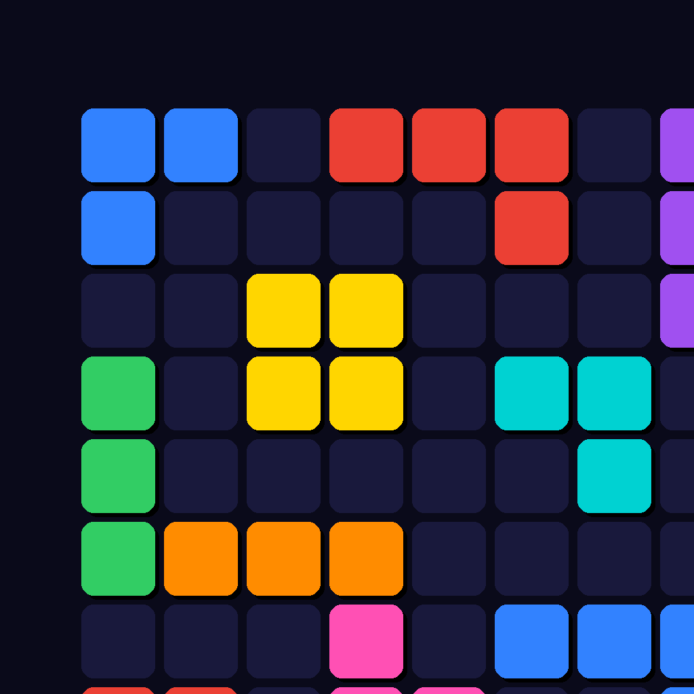

<div align="center">



# 🟦 Nova Block

**SpriteKit ile geliştirilmiş modern iOS blok bulmaca oyunu**

*Sürükle. Yerleştir. Patlat.*

<br/>

[](https://developer.apple.com/ios/)
[](https://swift.org)
[]()
[](LICENSE)
[](https://github.com/muhammedeminalan/BlockNova)
[](https://apps.apple.com/us/app/nova-block/id6760556862)

</div>

---

## 📸 Ekran Görüntüleri

<div align="center">

| Ana Ekran | Oyun Başlangıcı | Oynanış | Oyun Sonu |
|:---------:|:---------------:|:-------:|:---------:|
|  |  |  |  |

</div>

---

## 🎮 Oyun Hakkında

**Nova Block**, 8×8 bir ızgaraya renkli blok parçaları yerleştirdiğin, dolu satır ve sütunları patlatarak puan topladığın bir bulmaca oyunudur. Zamanlama baskısı yoktur — her hamleyi düşünerek yapabilirsin. Asıl zorluk, ızgaranın dolmasına izin vermeden ne kadar uzun hayatta kalabileceğindir.

> Basit kurallar, derin strateji. Bir oyun başladığında bırakmak zordur.

---

## ✨ Özellikler

### Temel Oynanış
- **8×8 ızgara** — Klasik blok bulmaca alanı, 64 hücre
- **12 benzersiz şekil** — Tekli hücre, 2/3'lü çizgiler, 2×2/3×3 kareler, L · J · T · S · Z tetromino'lar
- **Akıllı sürükle-bırak** — Parça parmağın üzerinden kalkar, ızgara hücresine otomatik snap'lenir
- **Combo sistemi** — Aynı hamlede birden fazla çizgi patlatarak katlamalı bonus puan kazan
- **Oyun sonu tespiti** — Hiçbir parça ızgaraya sığmadığında oyun otomatik biter

### Puan Sistemi

| Aksiyon | Puan |
|---|---|
| Her yerleştirilen hücre | +1 |
| 1 satır / sütun temizleme | +10 |
| 2 çizgi aynı anda temizleme | +35 *(combo bonusu)* |
| 3+ çizgi aynı anda temizleme | +n×10 + 50 *(üst combo bonusu)* |

### Görsel Geri Bildirim
- **Yeşil / Kırmızı önizleme** — Sürükleme sırasında geçerli/geçersiz alana anlık renk gösterimi
- **Uçan metin efektleri** — `LINE!` · `DOUBLE!` · `COMBO x3!` ekran animasyonları
- **"YENİ REKOR!"** badge'i — Oyun içinde rekor kırılınca patlama animasyonu
- **Skor micro-animasyon** — Her puan güncellemesinde label canlanır

### Platform & UX
- **Game Center liderlik tablosu** — Dünyadaki diğer oyuncularla global sıralama
- **Kaldığın yerden devam** — Uygulama kapansa, çöküse ya da telefon kilitlense bile oyun devam eder
- **Haptic feedback** — Yerleştirme, çizgi temizleme ve oyun sonu için ayrı titreşim profilleri
- **Ses efektleri** — Her aksiyon için özel ses tasarımı
- **Loading ekranında arka plan Game Center auth** — Kimlik doğrulama oyunu bloklamaz, arka planda tamamlanır
- **Responsive tasarım** — Tüm iPhone boyutlarında (SE'den Pro Max'e) pixel-perfect görünüm

---

## 🛠 Teknik Detaylar

| | |
|---|---|
| **Platform** | iOS 15.5+ · iPhone · Portrait |
| **Dil** | Swift 5 |
| **Framework** | SpriteKit · GameKit · UIKit |
| **Mimari** | MVC + Extension tabanlı Scene ayrımı |
| **Kalıcılık** | UserDefaults — sunucu yok, ağ bağlantısı gerekmez |
| **Bağımlılık** | **Sıfır** — hiçbir third-party kütüphane kullanılmadı |
| **Boyut yönetimi** | Tüm değerler `screenW / screenH` oransal — hardcode piksel yok |

---

## 📐 Mimari Kararlar

| Karar | Gerekçe |
|---|---|
| Fizik motoru kullanılmadı | Grid tabanlı mantık deterministik ve öngörülebilir olmalıydı |
| Node'lar silinmiyor, renk değiştiriliyor | Frame freeze sorunlarını tamamen ortadan kaldırır |
| `touchesMoved`'da SKAction yok | Direkt `position` ataması ile gecikme sıfır, sürükleme akıcı |
| `GameManagerDelegate` pattern | Skor/durum değişiklikleri Scene'e gevşek bağlı — test edilebilir |
| Dengeli şekil dağıtımı | Shuffle bag + geçmiş bazlı red algoritması oyunu adil tutar |

---

## 📁 Proje Yapısı

```
BlockNova/
├── AppDelegate.swift               # Game Center auth başlatma
├── GameViewController.swift        # SpriteKit host, GKGameCenterControllerDelegate
│
├── Scenes/
│   ├── LoadingScene.swift          # Splash ekranı + arka plan auth bekleme
│   ├── HomeScene.swift             # Animasyonlu ana menü
│   ├── GameScene.swift             # Ana oyun döngüsü ve dokunma yönetimi
│   ├── GameScene+Layout.swift      # Safe area'ya duyarlı responsive yerleşim
│   └── GameScene+Overlay.swift     # Oyun sonu modal yapısı
│
├── Nodes/
│   ├── GridNode.swift              # 8×8 ızgara çizimi + oyun mantığı
│   ├── BlockNode.swift             # Tekil hücre node'u
│   └── PieceNode.swift             # BlockNode'lardan oluşan sürüklenebilir parça
│
├── Models/
│   ├── BlockShape.swift            # 12 şekil tanımı (tip, offset dizisi, renk)
│   ├── GameManager.swift           # Skor, durum makinesi, Game Center entegrasyonu
│   └── ShapeDispenser.swift        # 3 katmanlı dengeli dağıtım algoritması
│
├── ViewModels/
│   └── GameViewModel.swift         # Skor metinleri ve label formatlaması
│
├── Sounds/                         # Oyun içi ses efektleri
│
└── Utils/
    ├── Constants.swift             # Tüm boyutlar screenW/screenH oransal
    ├── HapticManager.swift         # UIImpactFeedbackGenerator sarmalayıcısı
    ├── SoundManager.swift          # Ses efekti oynatma yönetimi
    └── GameSaveManager.swift       # UserDefaults ile oyun kaydetme/yükleme
```

---

## 🚀 Kurulum

Xcode 15+ gereklidir. Bağımlılık yöneticisi gerekmez:

```bash
git clone https://github.com/muhammedeminalan/BlockNova.git
cd BlockNova
open BlockNova.xcodeproj
```

Simulator veya fiziksel cihazda direkt çalıştırılabilir.

> **Not:** Game Center özellikleri (liderlik tablosu) yalnızca fiziksel cihazda çalışır.

---

## 👤 Geliştirici

<div align="center">

**Muhammed Emin Alan**

[](https://github.com/muhammedeminalan)

</div>

---

## 📄 Lisans

Bu proje [MIT Lisansı](LICENSE) altında dağıtılmaktadır.

---

<div align="center">
  <a href="https://apps.apple.com/us/app/nova-block/id6760556862">
    
  </a>
  <br/><br/>
  <sub>Built with ❤️ using Swift & SpriteKit</sub>
</div>
