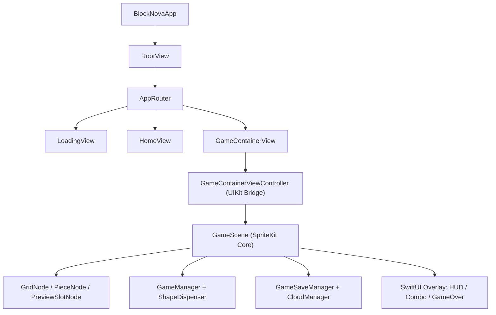

<div align="center">
  
  <h1>BlockNova</h1>
  <p><b>SwiftUI + SpriteKit hibrit mimari ile geliştirilen native iOS blok bulmaca oyunu</b></p>
  <p>Sürükle. Yerleştir. Satır ve sütunları temizle. Zinciri büyüt.</p>

[](https://developer.apple.com/ios/)
[](https://swift.org)
[](https://developer.apple.com/xcode/swiftui/)
[](https://developer.apple.com/spritekit/)
[](https://github.com/muhammedeminalan/BlockNova/actions/workflows/ios-ci.yml)
[](LICENSE)
[](https://apps.apple.com/us/app/nova-block/id6760556862)
</div>

---

## İçindekiler

- [Proje Özeti](#proje-özeti)
- [Mimari Snapshot](#mimari-snapshot)
- [Ekran Görüntüleri](#ekran-görüntüleri)
- [Öne Çıkan Özellikler](#öne-çıkan-özellikler)
- [Proje Yapısı](#proje-yapısı)
- [Kurulum (Hızlı)](#kurulum-hızlı)
- [Kurulum (Detaylı)](#kurulum-detaylı)
- [Kalite Kapıları](#kalite-kapıları)
- [Dokümantasyon](#dokümantasyon)
- [Katkı](#katkı)
- [Lisans](#lisans)

---

## Proje Özeti

BlockNova, 8x8 grid üzerinde oynanan, sürükle-bırak odaklı bir blok bulmaca oyunudur.

Proje, son migrasyonlarla birlikte hibrit bir yapıya geçti:
- Oyun çekirdeği ve drag mekaniği **SpriteKit** tarafında.
- Home / Loading / Settings / HUD / Overlay katmanları **SwiftUI** tarafında.
- Yönlendirme ve ekran geçişleri `AppRouter` üzerinden yönetiliyor.
- Oyun sahnesi `GameContainerView` ile SwiftUI içine host ediliyor.

---

## Mimari Snapshot



Detaylı mimari dokümanı: [ARCHITECTURE.md](ARCHITECTURE.md)

---

## Ekran Görüntüleri

<div align="center">

| Ana Ekran | Oyun Başlangıcı | Oynanış | Oyun Sonu |
|:---------:|:---------------:|:-------:|:---------:|
|  |  |  |  |

</div>

---

## Öne Çıkan Özellikler

- 8x8 oyun tahtası ve akıcı sürükle-bırak deneyimi
- 29 farklı blok şekli (micro/line/rectangle/corner/zigzag)
- Milestone bazlı combo efekt akışı (`5`, `10`, `15` zinciri)
- Kırılan hücre üstünde puan popup animasyonları
- Canlı skor animasyonlu oyun içi HUD
- iCloud + local fallback high score senkronu
- Game Center liderlik tablosu entegrasyonu
- Oyun state kalıcılığı (arka plan/kapanış sonrası devam)
- Ses + titreşim ayarları

---

## Proje Yapısı

```text
BlockNova/
├── App/
│   ├── BlockNovaApp.swift
│   ├── RootView.swift
│   ├── AppRouter.swift
│   └── AppDelegate.swift
├── Core/
│   ├── Constants.swift
│   ├── CloudManager.swift
│   ├── GameSaveManager.swift
│   ├── HapticManager.swift
│   ├── SoundManager.swift
│   └── NotificationNames.swift
├── Game/
│   ├── Models/
│   ├── Logic/
│   └── ViewModels/
├── UI/
│   ├── Loading/
│   ├── Home/
│   ├── Settings/
│   ├── Game/
│   │   └── Components/
│   ├── Scenes/
│   ├── Nodes/
│   └── Common/
├── Utils/
│   └── SettingsManager.swift
├── Resources/
│   ├── Assets.xcassets/
│   ├── Base.lproj/LaunchScreen.storyboard
│   └── Sounds/
└── SupportingFiles/
    └── BlockNova.entitlements
```

---

## Kurulum (Hızlı)

```bash
git clone https://github.com/muhammedeminalan/BlockNova.git
cd BlockNova
open BlockNova.xcodeproj
```

---

## Kurulum (Detaylı)

1. Gereksinimler
- Güncel stabil Xcode sürümü
- iOS 15.6+ hedefleyen bir cihaz/simulator
- App Store/Game Center testleri için Apple ID (fiziksel cihaz önerilir)

2. Projeyi aç
- `BlockNova.xcodeproj` dosyasını Xcode ile aç.
- Target: `BlockNova`
- Scheme: `BlockNova`

3. Signing & Capabilities
- `Signing & Capabilities` altında kendi Team’ini seç.
- Bundle Identifier çakışmıyorsa mevcut kimlikle devam et.
- Gerekli capability’ler:
  - Game Center
  - iCloud (Key-Value Storage)

4. Çalıştırma profilleri
- Gameplay doğrulaması: fiziksel cihaz
- Görsel/screenshot: simulator
- Not: simulator’da Game Center/iCloud log gürültüsü görülebilir; bu tek başına crash anlamına gelmez.

5. Archive öncesi checklist
- `Version` ve `Build` numaralarını artır
- Release archive al
- Kısa smoke test yap:
  - Home -> Game -> Settings -> Home
  - Hızlı sürükle-bırak + combo
  - Game over -> replay/home

---

## Kalite Kapıları

CI pipeline şu adımları otomatik koşar:
- Debug build
- Release build
- Static analyze

Workflow: [ios-ci.yml](.github/workflows/ios-ci.yml)

Not: Projede henüz test target tanımlı değil; bu yüzden ana kalite kapısı build + analyze + manuel smoke test.

---

## Dokümantasyon

- Mimari ve sorumluluk haritası: [ARCHITECTURE.md](ARCHITECTURE.md)
- Katkı kuralları: [CONTRIBUTING.md](CONTRIBUTING.md)
- Davranış kuralları: [CODE_OF_CONDUCT.md](CODE_OF_CONDUCT.md)
- Test checklist: [TEST_CHECKLIST.md](TEST_CHECKLIST.md)

---

## Katkı

Katkı sürecini başlatmadan önce:
1. [CONTRIBUTING.md](CONTRIBUTING.md) dosyasını oku.
2. Uygunsa issue aç veya mevcut issue’yu üstlen.
3. Küçük, odaklı PR gönder.

---

## Lisans

Bu proje [MIT Lisansı](LICENSE) ile yayınlanmaktadır.
